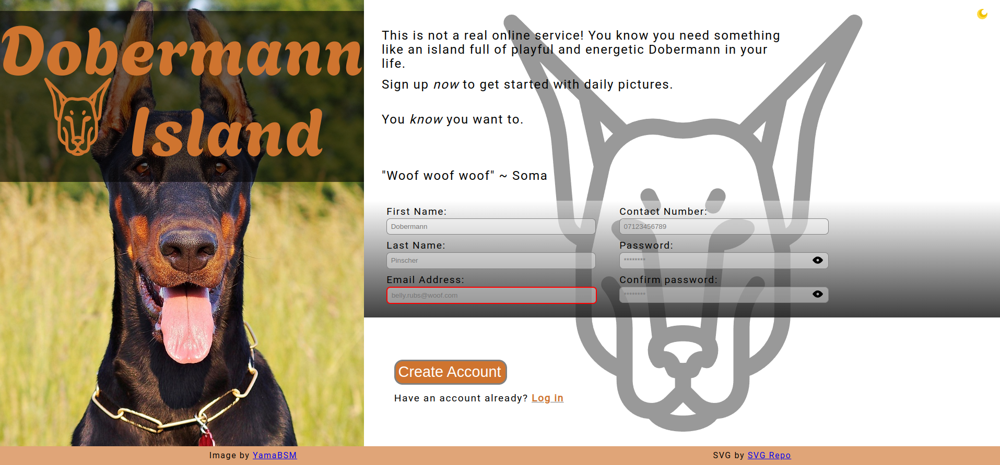

# Sign-up Form



## Summary

**Hosted:** [Sign-up Form](https://blurryq.github.io/sign-up-form/)

I developed a sign-up page to enhance my skills in form handling, error management, and user experience design.

## Features

- **Error Handling**: Validation to ensure user inputs are accurate and feedback is provided.
- **Dynamic Display**: Interactive elements that respond in real-time based on user input.
- **Light/Dark Mode**: A toggle feature allowing users to switch between light and dark themes for a personalized experience.

## Setup

To get started with this project, follow the steps below:

### 1. Fork the Repository

First, you need to fork this repository to your GitHub account by clicking the "Fork" button near the top right of this page. If you are unfamiliar with this process, please follow this GitHub [guide](https://docs.github.com/en/pull-requests/collaborating-with-pull-requests/working-with-forks/fork-a-repo).

### 2. Clone the Repository

Next, clone the repository to your local machine using the following command. Make sure to replace `your-username` with your GitHub username:

```
git clone https://github.com/your-username/landing-page
```

### 3. Running the File

Once cloned, navigate to your project folder, locate the HTML file, and double-click it. This should open the file in your default browser.

Alternatively, if you're using Visual Studio Code, you can install the "Live Server" extension and use it to launch the project by right-clicking on the HTML file and selecting **Open with Live Server**.

## Challenges and Skills Demonstrated

This project was built to further my knowledge of utilizing a forms in a webpage, with dynamic error handling with a focus on UX and accessibility.

## Skills Demonstrated

- **Responsive Design**: Utilized flexible units, `clamp()` functions, and media queries in HTML and CSS to ensure the page is adaptive across various screen sizes, from desktop to mobile.
- **Custom Theme Toggle**: Implemented JavaScript for toggling between light and dark themes, allowing seamless user experience. CSS employs custom properties (variables) to define colors and backgrounds based on the selected theme, managed through toggling the root class.
- **Form Validation and Feedback**: Incorporated real-time feedback for form fields, dynamically adding or removing validation classes:
  - **Text Inputs**: Fields like "First Name" and "Last Name" receive a "valid" class upon entry, indicating successful validation.
  - **Phone Number Validation**: The phone number field enforces a numeric-only input with length restrictions, switching styles based on validation status.
  - **Password Matching and Length Check**: Password and confirm password fields are validated for matching values and appropriate lengths, with dynamic error messages guiding users when discrepancies arise.
- **Accessible Visual Feedback**: Implemented color coding and box-shadow effects on the submit button to enhance user experience, providing clear visual cues for interaction states (e.g., focus and hover).
- **Password Visibility Toggle**: Included toggle buttons that allow users to switch the visibility of password fields, improving usability during password entry.
- **JavaScript for Submit Button Control**: The form's submit button is initially disabled and only activates when all validation criteria are satisfied.

### Challenges Faced

- **Light and Dark Theme Toggle**: Establishing a theme toggle that dynamically adjusts multiple elements while avoiding flicker or lag in the user interface.
- **Real-time Form Validation**: Implementing dynamic validation for various fields (e.g., text inputs, phone number, password) presents challenges in managing edge cases, such as non-numeric characters in phone inputs and synchronization of password entries.
- **Toggle Show/Hide for Password Fields**: Ensuring that the password visibility toggle functions seamlessly across both password fields without disrupting form validation, particularly when managing multiple toggle buttons.